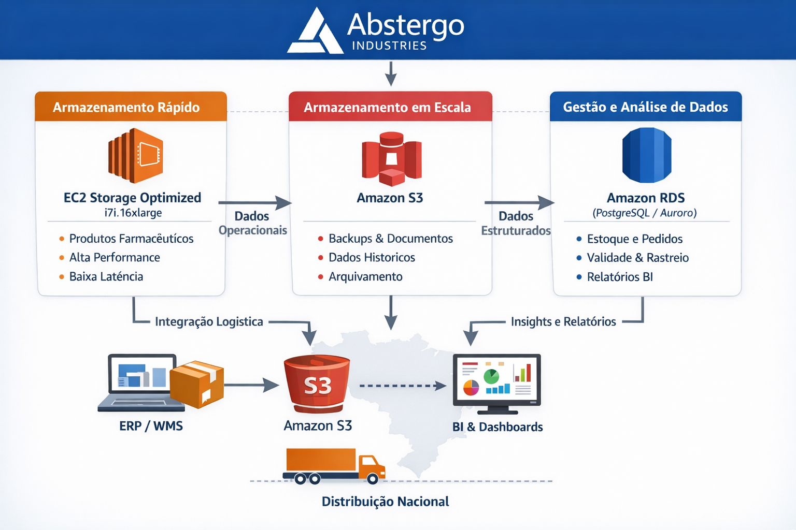

# RELATÓRIO DE IMPLEMENTAÇÃO DE SERVIÇOS AWS

Data: 23/12/2025  
Empresa: Abstergo Industries  
Responsável: Jackson dos Santos Ventura  

## Introdução
Este relatório apresenta o processo de implementação de ferramentas na empresa Abstergo Industries, realizado por Jackson dos Santos Ventura. O objetivo do projeto foi elencar 3 serviços AWS, com a finalidade de realizar diminuição de custos imediatos.

## **Arquitetura da Solução AWS**

## Descrição do Projeto
O projeto de implementação de ferramentas foi dividido em 3 etapas, cada uma com seus objetivos específicos. A seguir, serão descritas as etapas do projeto:

**Etapa 1:** Armazenamento e acesso rápido aos produtos

- EC2 otimizada para armazenamento - (i7i.16xlarge, 64 vCPUs, 512 GB RAM, 4 x 3.750 GB NVMe = 15.000 GB, alta taxa de IOPS)

**Finalidade:**  
- Armazenamento on-line dos produtos farmacêuticos destinados à distribuição nacional, garantindo alta disponibilidade e performance no acesso aos dados.

**Benefícios para o processo:**  

- Acesso rápido às informações de estoque
- Redução de latência na busca de produtos
- Suporte a grandes volumes de dados operacionais
- Possibilidade de integração com sistemas de ERP e controle logístico

**Ganho operacional e financeiro:**

- Melhor organização do estoque
- Menor tempo de separação e expedição de produtos
- Infraestrutura escalável conforme a demanda, evitando custos desnecessários em períodos de menor uso
- Essa é a base da operação, garantindo performance e estabilidade para o restante da arquitetura.

Essa é a base da operação, garantindo performance e estabilidade para o restante da arquitetura.

**Etapa 2:** Armazenamento escalável e redução de custos

- Amazon S3 (Simple Storage Service) - (com uso de classes Standard, Intelligent-Tiering e Glacier)

**Finalidade:**

- Armazenamento em larga escala de dados históricos, documentos regulatórios, notas fiscais, relatórios de qualidade, logs e backups do estoque farmacêutico.

**Benefícios para o processo:**

- Armazenamento praticamente ilimitado
- Fácil integração com outros serviços AWS
- Alta durabilidade (11 9’s) e segurança dos dados
- Acesso rápido quando necessário e arquivamento automático de dados menos usados

**Ganho operacional e financeiro:**

- Redução significativa de custos em comparação a manter tudo em EC2
- Uso do S3 Intelligent-Tiering para mover dados automaticamente entre camadas
- Uso do S3 Glacier para dados regulatórios que precisam ser mantidos por anos, mas raramente acessados

Essa etapa garante escala e economia, sem perder conformidade regulatória.

**Etapa 3:** Gestão inteligente do estoque e análise de dados

- Amazon RDS (PostgreSQL ou Aurora PostgreSQL)

**Finalidade:**

- Centralizar dados estruturados de estoque, pedidos, validade de medicamentos, fornecedores e distribuição em um banco de dados gerenciado.

**Benefícios para o processo:**

- Consultas rápidas sobre disponibilidade de produtos
- Controle de validade e rastreabilidade de medicamentos
- Alta confiabilidade com backups automáticos
- Integração com ferramentas de BI e análise de dados

**Ganho operacional e financeiro:**

- Eliminação de custos com manutenção manual de banco de dados
- Escalabilidade automática conforme crescimento da empresa
- Redução de erros operacionais e perdas por vencimento de produtos

Essa etapa transforma dados em informação estratégica para tomada de decisão.

## **Conclusão**

A implementação das ferramentas em nuvem na empresa Abstergo Industries tem como objetivo principal otimizar o armazenamento, a gestão e o acesso aos dados relacionados aos produtos farmacêuticos destinados à distribuição nacional. A adoção dos serviços da AWS, como EC2 otimizada para armazenamento, Amazon S3 e Amazon RDS, proporcionará maior eficiência operacional, escalabilidade e segurança das informações.

Com essa arquitetura, a empresa passa a contar com uma infraestrutura robusta, capaz de atender às demandas atuais e futuras, reduzindo custos operacionais por meio do uso inteligente de recursos em nuvem e melhorando a produtividade das equipes envolvidas nos processos logísticos e de gestão de estoque.

Recomenda-se a continuidade da utilização das ferramentas implementadas, bem como a avaliação constante de novas tecnologias e serviços que possam contribuir para a automação, otimização e evolução contínua dos processos da Abstergo Industries, garantindo competitividade, conformidade regulatória e excelência operacional.

## **Anexos**

- Documento de arquitetura da solução AWS (diagrama da infraestrutura)
- Planilha de estimativa de custos e otimização de uso dos serviços AWS   
- Manual de boas práticas de segurança e controle de acesso (IAM)
- Documentação de políticas de backup e retenção de dados
- Relatório de requisitos regulatórios aplicáveis ao setor farmacêutico
- Plano de escalabilidade e crescimento da infraestrutura

**Assinatura do Responsável pelo Projeto:**  
Jackson Ventura